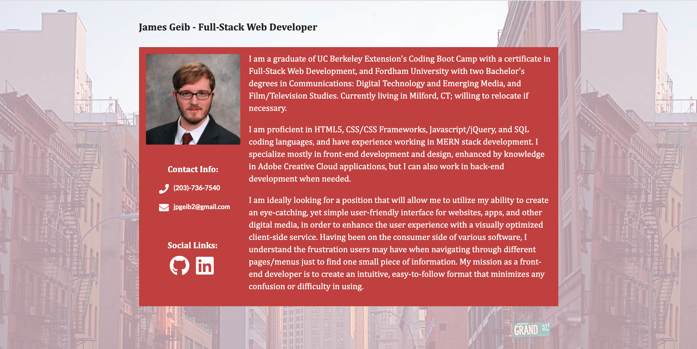
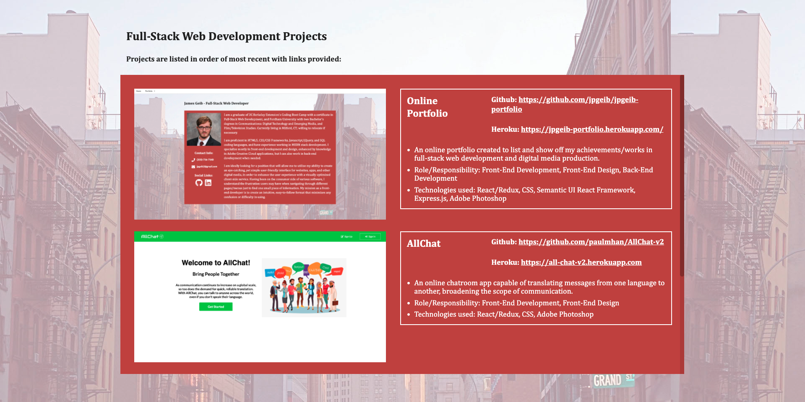
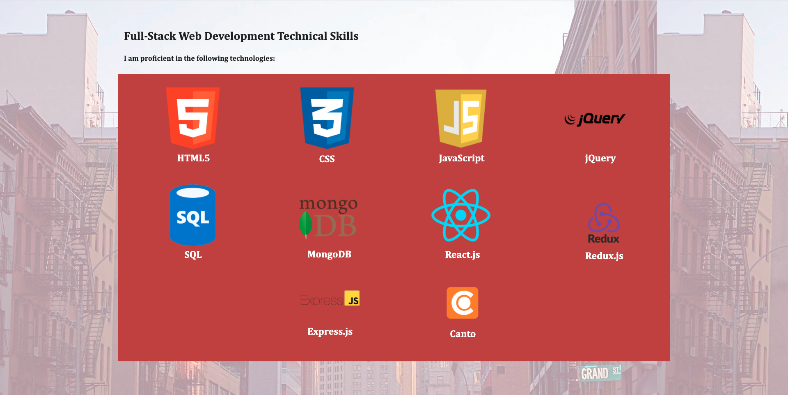
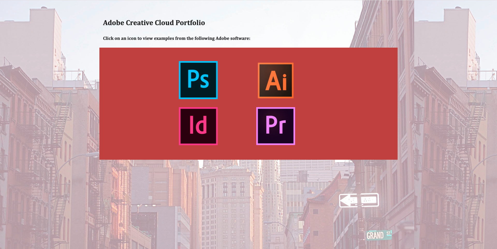

# James Geib - Full-Stack Web Development/Adobe Creative Cloud Online Portfolio

An online portfolio designed to showcase my abilities/work in full-stack web development and Adobe Create Cloud applications. In other words, a visual representation of my résumé.

## Motivation

Given my credentials, I believed the best way to attest for my technical knowledge would be to create an application made with those very skills. After all, a simple résumé can "tell" an employer or potential client of my aptitude, but an online portfolio can "show" them.

## Code Style

  

  <a href="#features">Features</a> •
  <a href="#technologies-used">Technologies Used</a> •
  <a href="#credits">Credits</a>

## Features

* The Projects subsection of my web development portfolio lists all of my past projects in chronological order with most recent placed at the top, and oldest at the bottom. Links to their respective GitHub repositories and and live Heroku apps are provided for each.

* The Skills subsection lists every technology I consider myself to be proficient in. This page will be actively updated over time.

* The Adobe Creative Cloud section be actively updated over time. Clients/employers can click on an icon to download a zip file containing all examples of my work for the corresponding application.

## Technologies Used

- [React](https://reactjs.org/)
- [Express.js](https://expressjs.com)
- [Node.js](https://nodejs.org/en/)

## Credits

- James Geib:
    - Front-end Development
    - Front-end Design
    - Back-end Server
    - GitHub: https://github.com/jpgeib
